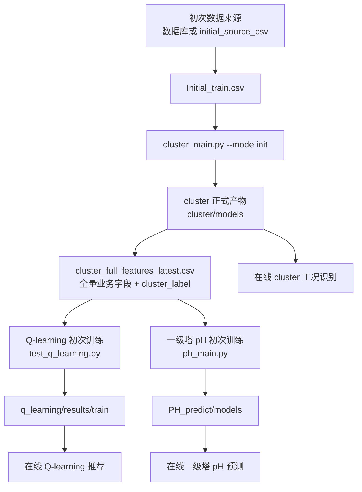
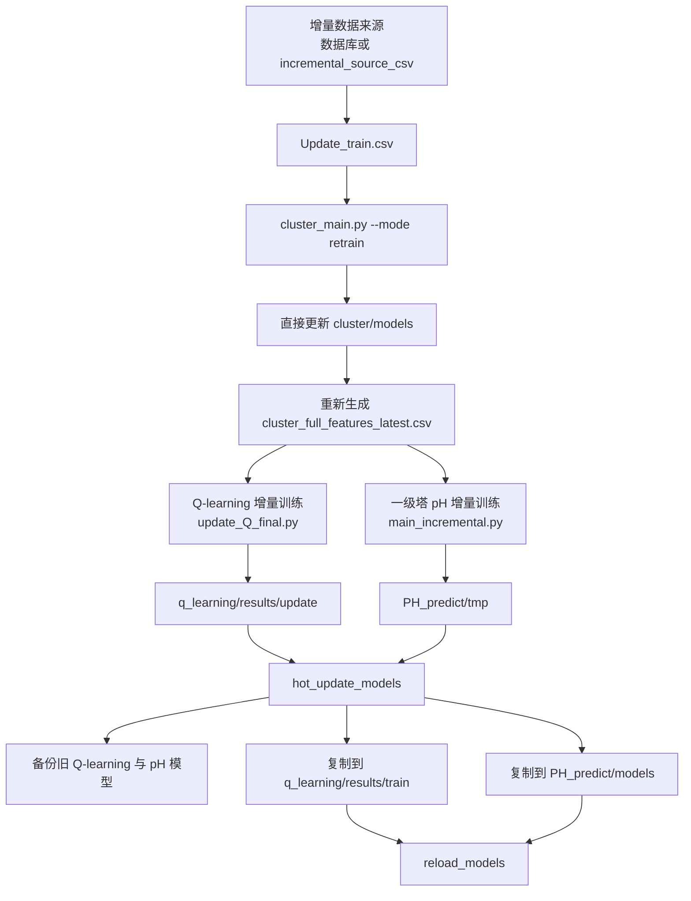

# 西热钢厂单塔循环泵寻优系统

## 1. 项目简介

本项目面向湿法烟气脱硫单塔系统，通过历史数据和实时测点完成：

1. 工况划分与在线工况识别；
2. 循环泵组合离线评分、增量更新和在线推荐；
3. 一级塔浆液 pH 变化预测与降泵 pH 建议；
4. 快变工况保护、启停约束、同功率防跳变和推荐结果展示。

当前项目配置为 **单塔、5 台一级塔循环泵、无二级塔 APT**。泵数量、功率和合法运行台数统一由 `system/model/map_control/project_config.py` 管理。

## 2. 主流程

```text
原始实时数据
  → DataPreprocessor 数据清洗与派生特征
  → cluster 工况识别 / fast_change 风险判断
  → q_learning 循环泵组合推荐
  → PH_predict 一级塔 pH 建议
  → Process4MapControl 快照、写库、前端与 DCS 输出
```

程序入口：

```powershell
python Application.py
```

## 3. 统一基础配置

| 配置文件 | 作用 | 常改参数 |
|---|---|---|
| `system/model/map_control/project_config.py` | 项目路径、单/双塔结构、泵数量、泵字段、功率和合法泵数模式 | `xst_pump_count`、`apt_pump_count`、`pump_status_columns`、`pump_powers`、`valid_pump_patterns` |
| `system/model/config/process4map_config.py` | Process4MapControl 的停机、校验、队列、快照、断线、训练和写库参数 | `UnitStopConfig`、`DataValidationConfig`、`RuntimeConfig`、`TrainingConfig` |
| `system/base/config/DataPreprocessorConfig.py` | 原始测点限幅、滤波、泵电流阈值和派生特征 | `limit_config`、`filter_config`、`current_threshold` |
| `system/base/config/SysConfig*.py` | 数据库、部署目录、Python 解释器和界面信息 | `dbconnetion`、`base_path`、`python_exe` |

### 停机判定配置

在 `system/model/config/process4map_config.py` 修改：

```python
UnitStopConfig(
    field='yyq_SO2',   # 也可配置成 jzfh、glfl 等实时数值字段
    comparison='lt',
    threshold=500.0,
    hold_seconds=300,
)
```

支持的比较方式：`lt`、`le`、`gt`、`ge`、`eq`、`ne`。只有条件连续满足保持时间后才判停机，中途恢复会清零计时。

## 4. cluster 工况模块

目录：`system/model/map_control/cluster/`

### 离线模块

入口：`cluster_main.py`

配置：`cluster_config.py`

常改参数：

- `DATA_FILE_PATH`：训练数据路径；
- `CLUSTER_FEATURES`：基础工况字段；
- `GRID_DEFINITION`：网格上下限和步长；
- `LG_*`：液气比合并参数；
- `PUMP_*`：泵组合统计和合并参数；
- `ENABLE_LABEL_STABILITY`：标签稳定开关。

初次划分：

```powershell
python -m system.model.map_control.cluster.cluster_main --csv <数据.csv> --mode init
```

增量重训：

```powershell
python -m system.model.map_control.cluster.cluster_main --csv <新增数据.csv> --mode retrain
```

### 在线模块

入口：`online_cluster.py`，由 `MapControPre.py` 和 `Process4MapControl.py` 调用。

在线参数仍在 `cluster_config.py`，重点包括：

- `DISTANCE_THRESHOLD`、`NEAREST_ASSIGN_MULTIPLIER`；
- `FAST_TREND_*`、`FAST_EFFECT_*`；
- `FAST_ADD_XST_PH_MIN`；
- `NON_FAST_SO2_*`。

## 5. q_learning 循环泵推荐模块

目录：`system/model/map_control/q_learning/`

统一配置：`common/config.py`

### 离线初次训练

入口：`train/test_q_learning.py`（内部调用 `QLearningTrainer`）

主要修改：

- 数据路径和输出目录；
- `INITIAL_*_WEIGHT` 初次奖励权重；
- SO2 奖励范围和目标；
- 样本筛选、动作评分、Q 表裁剪参数。

### 离线增量训练

入口：`update/update_Q_final.py`

主要修改：

- `INCREMENTAL_*_WEIGHT` 增量奖励权重；
- 历史/新数据比例；
- 增量批大小和更新阈值；
- 增量结果目录。

### 在线推荐

入口：`predict/test_Q_final.py`

分层候选生成：`predict/layered_pump_recommender.py`

在线参数仍在 `common/config.py`，重点包括：

- `PREDICT_MIN_COOLING_PERIOD`：停泵后重新启泵冷却时间；
- `MAX_DAILY_SWITCHES`：单泵每日启停次数；
- `MAX_SWITCHES_PER_ACTION`：单次动作最多改变泵位数；
- `ONLINE_Q_TOP_RATIO`、`ONLINE_Q_TOP_MIN_CANDIDATES`；
- `ONLINE_BLOCK_EQUAL_POWER_SWAP`；
- `ONLINE_STEADY_DROP_XST_PH_MAX`；
- `TOPK_*` 在线反馈参数。

## 6. PH_predict 一级塔 pH 模块

目录：`system/model/map_control/PH_predict/`

当前仅保留 **一级塔 `xstjy_PH`**，不再训练、加载、预测或输出 APT pH。

统一配置：`ph_model_config.py`

### 离线初次训练

入口：`ph_main.py`

```powershell
python -m system.model.map_control.PH_predict.ph_main --csv <cluster输出.csv>
```

主要修改：

- `DATA_FILE`、`MODEL_DIR`；
- `FEATURE_CONFIG`；
- `FUTURE_STEPS`；
- `MODEL_PARAMS`；
- `DATA_PROCESSING`；
- `DROP_PUMP_COMPENSATION`。

### 离线增量训练

入口：`main_incremental.py`

```powershell
python -m system.model.map_control.PH_predict.main_incremental --csv <新增数据.csv> --save_dir <临时模型目录>
```

增量训练严格沿用初次训练保存的 `model_features.pkl` 特征顺序。

### 在线预测

入口：`online_PH.py`

在线加载：

- `xst_ph_model.pkl`；
- `input_scaler.pkl`；
- `model_features.pkl`；
- `feature_info.json`。

旧双塔模型的 `feature_info.json` 不兼容当前版本，升级后需要重新执行一级塔 pH 初次训练。

## 7. Process4MapControl 参数位置

业务文件：`system/model/Process4MapControl.py`

配置文件：`system/model/config/process4map_config.py`

已经移出的参数包括：

- 输入字段和限幅范围；
- 数据校验码、SO2 有效性阈值和校验窗口；
- 停机字段、比较方式、阈值和持续时间；
- 数据队列、写库队列和线程数；
- 快照周期、断线宽限和维护周期；
- 初次/增量训练数据天数；
- 模型备份保留天数；
- 数据表前缀、训练脚本、工作 CSV、模型目录和备份目录。

## 8. 主要产物

| 模块 | 主要产物 |
|---|---|
| cluster | 工况中心、标签映射、网格统计、`cluster_full_features_latest.csv` |
| q_learning | 每工况 Q 表 `.pkl/.json`、增量 Q 表、Top-K 反馈文件 |
| PH_predict | `xst_ph_model.pkl`、`input_scaler.pkl`、`model_features.pkl`、`feature_info.json` |

## 9. 前端 UI 修改

Qt Designer 源文件：`resource/single_main.ui`

生成运行代码：

```powershell
pyuic5 resource/single_main.ui -o system/gui/base/SingleMainRootWindow.py
```

注意：重新执行 `pyuic5` 会覆盖手工修改的生成文件，因此界面结构应优先修改 `.ui`，运行逻辑修改 `ExtSingleWindow.py`。

## 10. Git 同步

```powershell
git switch agent/adapt-cluster-single-tower
git pull --ff-only origin agent/adapt-cluster-single-tower
```

更完整的配置说明见 `CONFIG_PARAMETER_GUIDE.md`。

## 11. Process4MapControl 自动训练数据源

配置文件：`system/model/config/process4map_config.py` 的 `TrainingConfig`。

初次和增量训练都支持两种数据来源：

```python
initial_data_source = 'database'       # 或 'csv'
initial_source_csv = ''                # CSV 模式填写绝对路径或项目相对路径
incremental_data_source = 'database'   # 或 'csv'
incremental_source_csv = ''
```

选择 `csv` 后不会访问数据库，但仍会执行原系统状态机。增量训练仍需满足：

```python
incremental_trigger_interval_days = 3
```

数据库取数参数：

```python
initial_training_days = 7
initial_minimum_records = 1
initial_database_record_limit = 0
incremental_training_days = 3
incremental_minimum_records = 1000
incremental_database_record_limit = 0
database_records_per_day = 2880
database_minimum_data_ratio = 0.90
```

`*_database_record_limit=0` 表示按“训练天数 × database_records_per_day”计算；设置为正整数时，直接按该条数从当前月和上月表读取最新数据。

训练工作 CSV、cluster/Q-learning/pH 脚本路径以及 pH 增量临时目录也全部位于 `TrainingConfig`。初次和增量流程都会先把最终选定的数据保存为工作 CSV，再交给 cluster，避免数据库数据、测试 CSV 和训练脚本实际输入不一致。

## 12. 三模块训练产物链路

本节说明 `Process4MapControl` 自动训练时，原始数据、工作 CSV、cluster、Q-learning 和一级塔 pH 模型之间的真实传递关系。初次和增量训练均支持 `database` 与 `csv` 两种数据来源；两种来源最终都会先生成统一工作 CSV，再进入 cluster。

### 12.1 数据来源与工作 CSV 规则

```text
initial_data_source / incremental_data_source
        │
        ├── database：按回看天数、取数上限和完整率从数据库读取
        └── csv：直接读取配置的 source_csv，不检查数据库数据量
                        │
                        ▼
               统一保存为工作 CSV
```

| 模式 | 原始数据配置 | 统一工作 CSV |
|---|---|---|
| 初次训练 | `initial_source_csv` 或数据库查询结果 | `system/model/map_control/model_csv/Initial_train.csv` |
| 增量训练 | `incremental_source_csv` 或数据库查询结果 | `system/model/map_control/model_csv/Update_train.csv` |

说明：

- `initial_minimum_records`、`incremental_minimum_records` 是允许启动训练的**最低行数门槛**，不是最大读取行数；
- CSV 模式达到最低门槛后，会读取和传递 CSV 的全部数据，不会截断到最低行数；
- `initial_database_record_limit`、`incremental_database_record_limit` 只在 `database` 模式下限制数据库取数；
- `initial_work_csv`、`incremental_work_csv` 在 CSV 和数据库两种模式下都会生成；
- 下游 cluster、Q-learning 和 pH 模块仍可能因缺失值、稳态规则、目标构造或样本有效性筛选而减少最终有效训练样本。

### 12.2 初次训练链路



对应文本链路：

```text
数据库或 initial_source_csv
→ Initial_train.csv
→ cluster --mode init
→ cluster/models/julei/cluster_full_features_latest.csv
├→ Q-learning 初次训练 → q_learning/results/train/
└→ 一级塔 pH 初次训练 → PH_predict/models/
```

### 12.3 cluster 初次训练产物

cluster 正式输出根目录：

```text
system/model/map_control/cluster/models/
```

主要产物：

```text
cluster/models/
├── scaler.pkl
├── grid/
│   ├── grid_definition.json
│   ├── grid_stats.json
│   ├── pump_stats.json                    # 启用泵组统计时生成/更新
│   ├── cell_to_region.json
│   ├── region_to_label.json
│   ├── label_to_regions.json
│   ├── grid_stats_by_label.json
│   └── pump_stats_by_label.json
├── cluster_centers/
│   ├── cluster_centers_with_label_original.csv
│   └── cluster_centers_with_label.csv
└── julei/
    └── cluster_full_features_latest.csv
```

| 产物 | 作用 |
|---|---|
| `scaler.pkl` | 保存离线工况特征标准化方式，供在线工况识别保持一致 |
| `grid_definition.json` | 固定网格特征、范围、步长、形状和区域分组 |
| `grid_stats.json` | 每个基础网格的数据量、液气比累计值和均值等统计 |
| `pump_stats.json` | 每个网格的历史泵组合统计，增量模式可继续累计 |
| `cell_to_region.json` | 基础网格到合并区域的映射 |
| `region_to_label.json` | 合并区域到最终 `cluster_label` 的映射 |
| `label_to_regions.json` | 以标签视角展示一个工况包含哪些区域 |
| `grid_stats_by_label.json` | 按最终标签汇总的网格统计 |
| `pump_stats_by_label.json` | 按最终标签汇总的泵组合统计 |
| `cluster_centers_with_label_original.csv` | 原始工程量空间的工况中心 |
| `cluster_centers_with_label.csv` | 标准化空间的工况中心，供在线和最近邻映射使用 |
| `cluster_full_features_latest.csv` | 原始业务字段基础上增加 `cluster_label`，是 Q-learning 和 pH 的统一输入 |

`cluster_full_features_latest.csv` 形态示例：

```csv
date,yyq_SO2,jyq_SO2,jzfh,xstjy_PH,xst_YW,liquid_gas_ratio,combined_pump_status,cluster_label
2026-08-01 00:00:00,1800,21.5,220,5.4,8.2,10.5,1-1-1-0-0,16
2026-08-01 00:00:30,1820,21.2,221,5.4,8.2,10.6,1-1-1-0-0,16
```

### 12.4 Q-learning 初次训练产物

输入：

```text
system/model/map_control/cluster/models/julei/cluster_full_features_latest.csv
```

输出目录：

```text
system/model/map_control/q_learning/results/train/
```

典型产物：

```text
q_learning/results/train/
├── q_table_condition_0.pkl
├── q_table_condition_0.json
├── q_table_condition_1.pkl
├── q_table_condition_1.json
├── ...
├── nearest_label_map.json
└── merge_manifest.jsonl                 # 启用 Q 表合并时使用
```

每个 `q_table_condition_<condition_id>.pkl` 保存：

```text
状态 → 候选泵组合动作 → Q 值或离线综合评分
```

对应 JSON 用于人工检查，形态示例：

```json
{
  "(16, ...)": {
    "best_action": "1-1-1-0-0",
    "actions_sorted": [
      {"action": "1-1-1-0-0", "score": 82.4, "count": 125},
      {"action": "1-1-0-1-0", "score": 79.6, "count": 83}
    ]
  }
}
```

`nearest_label_map.json` 用于记录空白工况或无有效 Q 表工况应借用的最近有效工况。启用空白工况补齐时，还可能为目标工况生成补齐后的 `q_table_condition_<id>.pkl`。

### 12.5 一级塔 pH 初次训练产物

输入：

```text
system/model/map_control/cluster/models/julei/cluster_full_features_latest.csv
```

输出目录：

```text
system/model/map_control/PH_predict/models/
```

产物：

```text
PH_predict/models/
├── xst_ph_model.pkl
├── input_scaler.pkl
├── model_features.pkl
└── feature_info.json
```

| 产物 | 作用 |
|---|---|
| `xst_ph_model.pkl` | 一级塔 pH 变化量 `delta_xst_ph` 的 XGBoost 模型 |
| `input_scaler.pkl` | pH 模型输入特征标准化器 |
| `model_features.pkl` | 初次训练确定的特征名称和严格排列顺序 |
| `feature_info.json` | 模型版本、泵数量、特征列表和最近训练时间等元数据 |

增量训练和在线预测必须沿用初次训练的 `model_features.pkl` 和 `input_scaler.pkl`，不能随意改变输入特征顺序。

### 12.6 增量训练链路

增量训练只在 `normal_operation` 阶段检查。CSV 模式会绕过数据库三天数据量判断，但仍需满足：

1. 已进入正常在线运行状态；
2. 达到 `incremental_trigger_interval_days`；
3. 增量 CSV 存在且行数达到 `incremental_minimum_records`。



对应文本链路：

```text
数据库或 incremental_source_csv
→ Update_train.csv
→ cluster --mode retrain
→ 更新 cluster 正式统计、映射、中心和带标签 CSV
→ cluster_full_features_latest.csv
├→ Q-learning 增量训练 → q_learning/results/update/
└→ pH 增量训练 → PH_predict/tmp/
→ 两个增量模块都成功后执行 hot_update_models()
→ 备份旧 Q-learning / pH 正式模型
→ 覆盖 q_learning/results/train/ 和 PH_predict/models/
→ reload_models()
```

### 12.7 cluster 增量产物

cluster 增量模式会读取已有网格定义、历史统计和标签映射，在历史基础上累计本次数据，然后重新生成：

```text
cluster/models/scaler.pkl
cluster/models/grid/*.json
cluster/models/cluster_centers/*.csv
cluster/models/julei/cluster_full_features_latest.csv
```

当前 cluster 增量结果直接写入正式 `cluster/models/`，没有独立的 `cluster/tmp/` 发布目录。

### 12.8 Q-learning 增量产物

基础正式 Q 表：

```text
system/model/map_control/q_learning/results/train/
```

增量临时结果：

```text
system/model/map_control/q_learning/results/update/
├── q_table_condition_<id>.pkl
├── q_table_condition_<id>.json
└── nearest_label_map.json
```

增量文件名与初次训练一致，只是保存目录不同。增量输出是更新后可完整使用的 Q 表，不只是差值文件。

### 12.9 一级塔 pH 增量产物

基础正式模型：

```text
system/model/map_control/PH_predict/models/
```

增量临时模型：

```text
system/model/map_control/PH_predict/tmp/
├── xst_ph_model.pkl
├── input_scaler.pkl
├── model_features.pkl
└── feature_info.json
```

增量 pH 会加载正式基础模型和初次特征顺序，在原模型基础上继续训练，并将完整新模型保存到 `tmp`。

### 12.10 热更新与备份

增量 Q-learning 和 pH 都完成后，旧正式模型会备份到：

```text
system/model/map_control/model_backups/<YYYYMMDD_HHMMSS>/
├── q_learning/
└── ph_predict/
```

随后执行：

```text
q_learning/results/update/* → q_learning/results/train/*
PH_predict/tmp/*            → PH_predict/models/*
```

最后重新加载在线模型。备份保留天数由 `model_backup_retention_days` 配置。

### 12.11 初次与增量产物对照

| 模块 | 初次训练 | 增量训练临时产物 | 在线正式读取 |
|---|---|---|---|
| 工作 CSV | `model_csv/Initial_train.csv` | `model_csv/Update_train.csv` | 不直接读取 |
| cluster | `cluster/models/*` | 当前直接覆盖 `cluster/models/*` | `cluster/models/*` |
| cluster 最终 CSV | `cluster_full_features_latest.csv` | 重新生成同名文件 | 作为 Q-learning/pH 训练输入 |
| Q-learning | `q_learning/results/train/*` | `q_learning/results/update/*` | `q_learning/results/train/*` |
| pH | `PH_predict/models/*` | `PH_predict/tmp/*` | `PH_predict/models/*` |
| 模型备份 | 初次通常不创建 | `model_backups/<时间戳>/*` | 不直接读取 |

### 12.12 当前版本一致性注意事项

当前增量发布不是三个模块完全原子化切换：

```text
cluster retrain → 直接覆盖 cluster/models
Q-learning      → 先写 results/update，再热更新
pH              → 先写 PH_predict/tmp，再热更新
```

因此在极端情况下，cluster 已更新成功但后续 Q-learning 或 pH 训练失败，可能暂时出现 cluster 为新版本、Q-learning/pH 仍为旧版本的情况。后续若要求三个模块严格版本一致，应改为：

```text
cluster → cluster/tmp
Q-learning → results/update
pH → PH_predict/tmp
三个模块全部成功
→ 一次性备份
→ 一次性发布三个正式目录
→ 一次性 reload_models()
```
